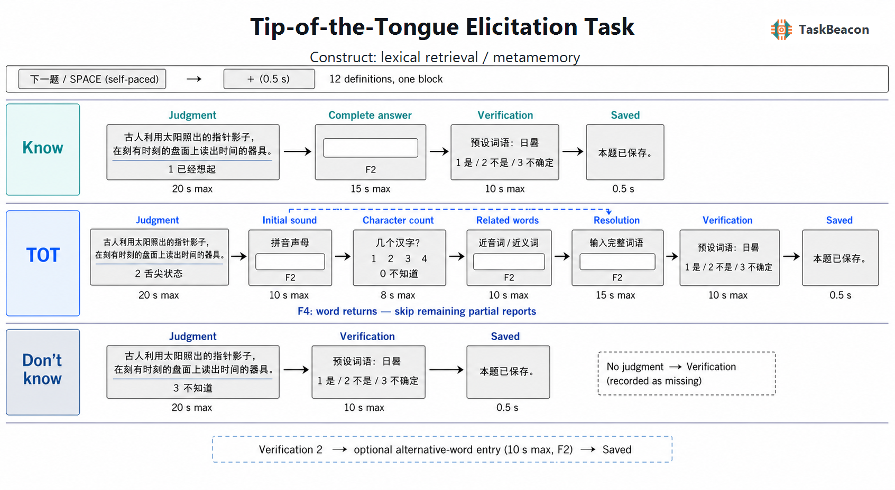

# Tip-of-the-Tongue Elicitation Task

| Field | Value |
|---|---|
| Name | Tip-of-the-Tongue Elicitation Task / 舌尖现象任务 |
| Version | 0.1.0 |
| URL / Repository | https://github.com/TaskBeacon/T000130-tip-of-the-tongue-task |
| Short Description | Original Chinese definition elicitation with partial information and target verification |
| Created By | TaskBeacon |
| Date Updated | 2026-08-31 |
| PsyFlow Version | 43e52fbfb5900e894d51ee7551cae971bb01f34e (Unicode TextBox2 adapter required) |
| PsychoPy Version | 2025.2.4 |
| Modality | Behavioral, visual definitions and keyboard/text |
| Language | Chinese / SimHei |
| Voice Name | zh-CN-YunyangNeural; disabled |

## 1. Task Overview

An individual computerized Chinese adaptation of Brown & McNeill (1966). Twelve newly written definitions elicit know, tip-of-the-tongue (TOT), and don't-know judgments. TOT trials collect partial information and spontaneous resolution before revealing the intended target. These candidate uncommon words and definitions are **not pilot-tested, frequency-normed or clinically validated**; their recognition familiarity and ambiguity must be established independently before research deployment.

## 2. Task Flow

### Block-Level Flow

| Stage | Behavior |
|---|---|
| Setup | Numeric ID101–999; initialize settings/window/stimuli/mock behavioral triggers |
| Instructions | Self-paced space; explicit distinction between inability to retrieve a word and only forgetting its written form |
| Block | 12 distinct item labels, built-in even BlockUnit scheduling, fixed seed130031 |
| End | Save one reduced row/item and descriptive summary; space to exit |

### Trial-Level Flow

| Phase | Participant experience / response |
|---|---|
| ready → fixation | Self-paced space → + for0.5s |
| judgment | Definition,20s:1 know /2 TOT /3 don’t know; timeout is missing |
| known_answer | Know only: blank text,15s,F2 submit |
| initial_sound | TOT only: first Mandarin consonant initial,10s,F2; zh/ch/sh kept whole,0 zero onset,y/w not initials |
| character_count | TOT only:1–4 characters,0 unknown,8s |
| related_words | TOT only: optional similar-sound/meaning words,10s,F2 |
| resolution | TOT only: blank complete-target entry,15s,F2. F4 during any partial phase skips remaining partial phases and starts this entry |
| verification | All: reveal target and choose1 sought/known,2 different,3 unfamiliar/unsure,10s |
| alternative_target | Verification2 only: optional alternative word,10s,F2; manual adjudication required |
| saved | No correctness feedback,0.5s |

### Controller Logic

No adaptive controller.

### Other Logic

| Measure | Definition |
|---|---|
| Reported TOT | judgment=TOT only; missing is distinct |
| Confirmed intended-target TOT | Reported TOT and exact submitted pre-reveal target OR verification1 |
| Confirmation basis | typed / recognition / both / none. Summary separates typed-confirmed and recognition-only. Recognition is subjective evidence |
| Spontaneous resolution | Reported TOT with correctly submitted target before reveal; incorrect/unsubmitted text is not resolution |
| Resolution latency | From TOT judgment response to first F4 report, else correct full-target submit, using shared high-resolution flip_time+rt. Includes partial-report activity and typing; not a pure covert retrieval time |
| Partial accuracy | Only usable submitted pre-resolution guesses within intended-target-confirmed TOT; denominator reported.0 count/invalid initial/missing excluded. F4 phase report is excluded |
| Alternative effective target | Raw alternative preserved; not scored as intended-target confirmation. This differs from source’s wider positive-TOT grouping |
| Text matching | NFKC,lowercase,remove spacing/punctuation; exact accepted simplified/traditional forms only. No fuzzy synonym scoring |

## 3. Configuration Summary

All settings are from `config/config.yaml`.

### a. Subject Info

| Field | Meaning |
|---|---|
| subject_id | Integer101–999; no names required |

### b. Window Settings

| Parameter | Value |
|---|---|
| size | [1280, 800] |
| units | pix |
| screen | 0 |
| bg_color | white |
| fullscreen | False |
| monitor_width_cm | 35.5 |
| monitor_distance_cm | 60 |

### c. Stimuli

| Name | Type | Description |
|---|---|---|
| instruction/ready/saved/good_bye | text | Chinese guidance and neutral status |
| definition | text | Original definition at y225; explicit line breaks |
| phase prompts/options | text | Distinct y110 and y−30 anchors |
| editor | textbox | Blank rebuilt per phase;1000×140 at y−10,28px font |
| entry/partial hints | text | y−145;F2 submits,F4 spontaneous retrieval |

### d. Timing

Seconds; all response phases end early on valid response.

| Phase | Duration |
|---|---|
| fixation_duration | 0.5 |
| judgment_duration | 20.0 |
| known_answer_duration | 15.0 |
| initial_sound_duration | 10.0 |
| character_count_duration | 8.0 |
| related_words_duration | 10.0 |
| resolution_duration | 15.0 |
| verification_duration | 10.0 |
| alternative_target_duration | 10.0 |
| saved_duration | 0.5 |

### e. Triggers

Behavioral mock by default.

| Event | Code |
|---|---|
| experiment_start | 1 |
| experiment_end | 99 |
| fixation_onset | 10 |
| saved_onset | 95 |
| judgment_onset | 20 |
| judgment_response | 21 |
| judgment_no_response | 29 |
| known_answer_onset | 30 |
| known_answer_response | 31 |
| known_answer_no_response | 39 |
| initial_sound_onset | 40 |
| initial_sound_response | 41 |
| initial_sound_no_response | 49 |
| character_count_onset | 50 |
| character_count_response | 51 |
| character_count_no_response | 59 |
| related_words_onset | 60 |
| related_words_response | 61 |
| related_words_no_response | 69 |
| resolution_onset | 70 |
| resolution_response | 71 |
| resolution_no_response | 79 |
| verification_onset | 80 |
| verification_response | 81 |
| verification_no_response | 89 |
| alternative_target_onset | 90 |
| alternative_target_response | 91 |
| alternative_target_no_response | 92 |
| judgment_tot | 22 |
| judgment_dont_know | 23 |
| initial_sound_resolved | 42 |
| character_count_resolved | 52 |
| related_words_resolved | 62 |
| verification_different | 82 |
| verification_unknown | 83 |

Timeout markers mean no registered response, not unconditional offsets. Native flip timestamps and browser monotonic clocks are software measurements; display/keyboard hardware timing is not calibrated.

Run native: `python main.py human`; QA: `psyflow-qa . --config config/config_qa.yaml --no-maturity-update`; simulations: `python main.py sim --config config/config_scripted_sim.yaml` or `config_sampler_sim.yaml`. QA/sim use four items and synthetic responses; human remains12. No text fixture is present in human config. Enter does not submit; F2 avoids conflict with Chinese text entry. Actual OS IME behavior must be checked on the intended acquisition machine; backend Unicode-event checks are not OS IME certification.

## 4. Methods (for academic publication)

The task adapts the definition-based elicitation and pre-reveal partial-report method of Brown and McNeill (1966; doi:10.1016/S0022-5371(66)80040-3). The original group oral English task used49 words and a response sheet. This implementation presents12 original Chinese definitions individually on a1280×800 white display using SimHei. Item count, deadlines, keyboard responses, visual delivery and resting screens are inferred implementation choices. No commercial dictionary definitions or published item bank were copied.

Participants classify retrieval as known, TOT, or unknown. A TOT indicates imminent access to a familiar word despite failed full retrieval. Partial initial-sound and character-count judgments adapt English letter/syllable reports to Mandarin; they are not interchangeable linguistic metrics. A spontaneous-retrieval report stops further partial collection. Full responses precede answer revelation and target verification. Both subjective recognition and objectively matched typed responses are preserved as separate confirmation bases. Descriptive rates use all presented trials as denominators, with missing judgments separately enumerated; partial-information accuracy uses only usable guesses from confirmed intended-target cases.

The original paper also considered independently recovered alternative effective targets in its positive-TOT analyses. Here those alternatives remain available for manual linguistic coding but do not count as confirmed intended targets automatically. Material familiarity, TOT yield, definition uniqueness, dialectal pronunciation, acceptable synonyms and input-method burden require an independent Mandarin-speaking pilot and adjudication plan. No pilot participants, reliability, norms, individual cognitive ratings or clinical validity are claimed.
